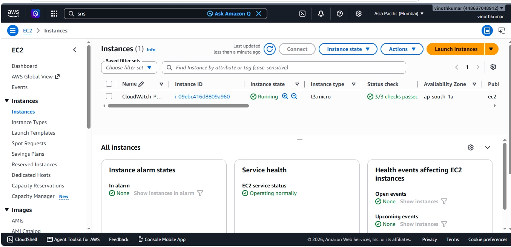
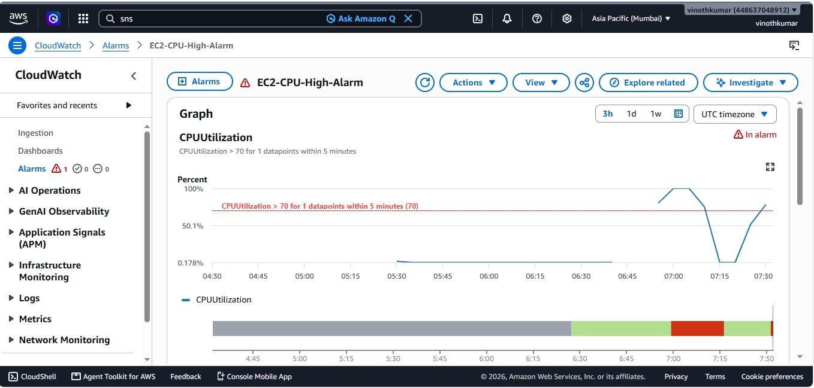
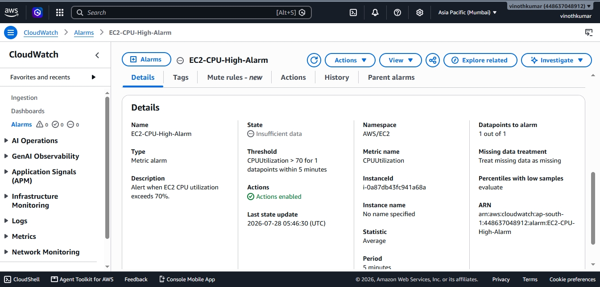
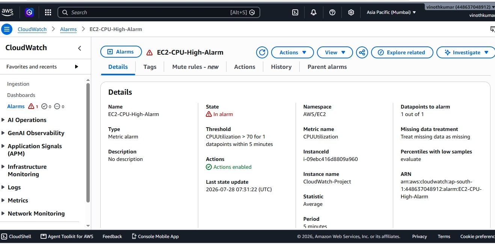
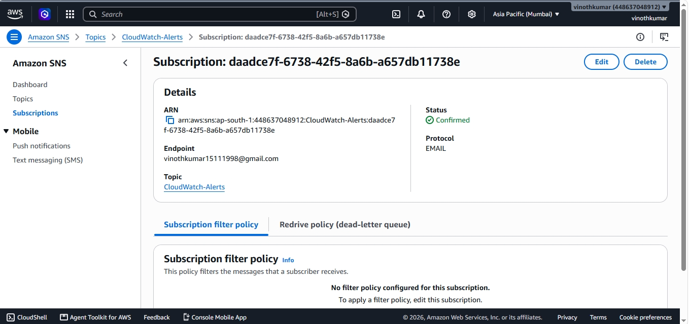
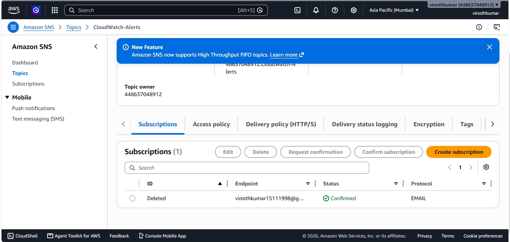
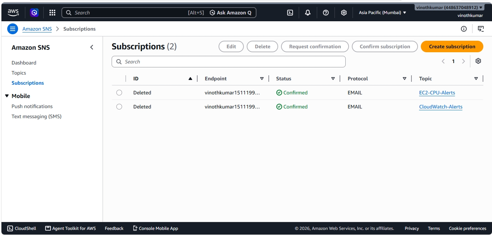

# AWS CloudWatch Monitoring Project

## Project Overview

This project demonstrates how to monitor an Amazon EC2 instance using AWS CloudWatch. It includes CloudWatch Metrics, CloudWatch Alarms, and Amazon SNS email notifications for CPU utilization monitoring.

## AWS Services Used

- Amazon EC2
- Amazon CloudWatch
- Amazon SNS
- IAM

## Features

- Launch an EC2 instance
- Monitor CPU Utilization
- Create CloudWatch Alarm
- Configure Amazon SNS
- Receive Email Notifications
- Monitor Alarm States (OK and In Alarm)

## Project Workflow

EC2 Instance  
↓  
CloudWatch Metrics  
↓  
CloudWatch Alarm  
↓  
Amazon SNS  
↓  
Email Notification

## Screenshots

### EC2 Running

### CloudWatch Graph

### Alarm Details

### Alarm In Alarm State

### SNS Subscription

### Subscription Confirmed

### Email Notification

## Skills Gained

- Amazon EC2
- Amazon CloudWatch
- CloudWatch Alarms
- Amazon SNS
- Monitoring & Alerting
- AWS Management Console

## Author

**M. Vinoth Kumar**
